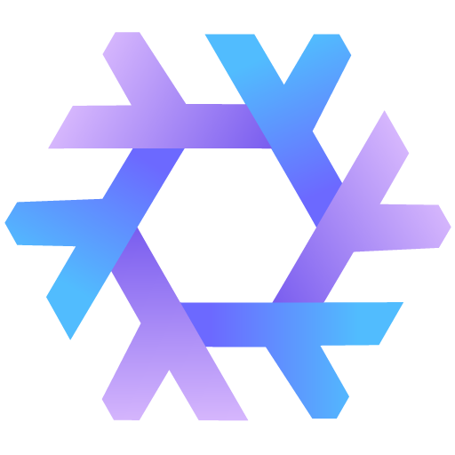
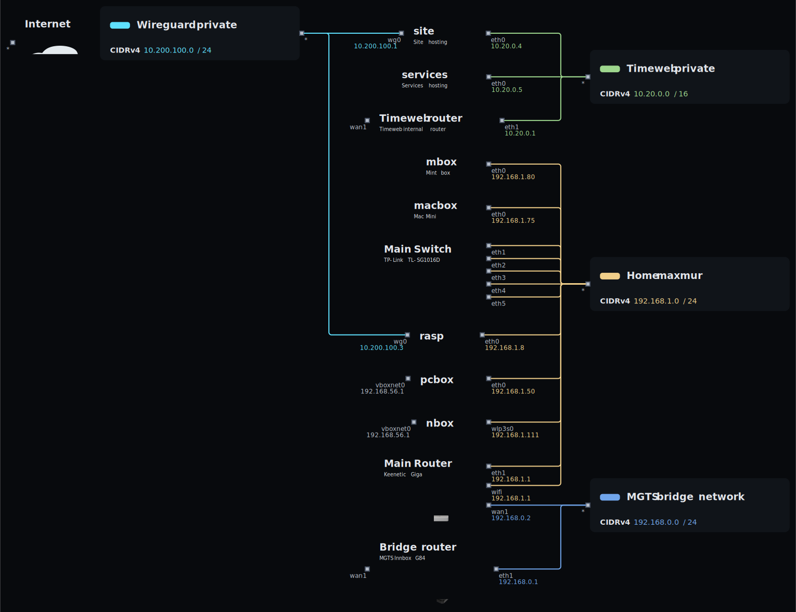

<h1 align="center">Spotandjake ❄️ NixOS Public Configuration</h1>

## Table of contents

- [Table of contents](#table-of-contents)
- [✨ Features](#-features)
- [📁 File structure](#-file-structure)
- [📘 Software](#-software)
- [👀 Network topology](#-network-topology)
- [🖥️ Hosts description](#️-hosts-description)

## ✨ Features

- ❄️ Flakes -- for precise dependency management of the entire system.
- 🏡 Home Manager -- to configure all used software for the user.
- 💽 Disko -- for declarative disk management: luks + lvm + btrfs.
- ⚠️ Impermanence -- to remove junk files and directories that are not specified in the config.
- 💈 Stylix -- to customize the theme for the entire system and the software you use.
- 🍎 NixDarwin -- to declaratively customize MacOS.
- 🔐 Lanzaboot -- to securely boot the system.
- 📁 Config file structure and modules with options.

## 📁 File structure

- [❄️ flake.nix](flake.nix) configuration entry point
- [🏡 home](home/default.nix) entry point for creating a home manager user
  - [🧩 modules](home/modules/) home manager modules
  - [♻️ overlays](home/overlays) home manager overlays
  - [👤 users](home/users) users configurations for home manager
    - [🧩 modules](home/users/spotandjake/modules/) home manager user modules
- [📃 lib](lib/default.nix) helper functions for creating configurations
- [🧩 modules](modules/default.nix) common modules for nixos/nixDarwin/home-manager
- [♻️ overlays](overlays/) common overlays
- [❄️parts](parts/) flake parts modules
- [💀pkgs](pkgs/) self-sealed packages
- [🖥️ system](system/default.nix) entry point for creating a machine
  - [🏎️ machine](system/machine) machines configurations
    - [🚀 hostname](system/machine/pcbox/) starting the configuration of a specific machine
      - [🧩 modules](system/machine/pcbox/modules) machine modules
        - [💾 hardware](system/machine/pcbox/modules/hardware) machine hardware modules
  - [🧩 modules](system/modules) common modules for machines
  - [♻️ overlays](system/overlays) common overlays for machines
- [📄 templates](templates/default.nix) templates for creating configuration parts

## 📘 Software

- OS - [**`NixOS`**](https://nixos.org/)
- Theme - [**`Nord`**](https://github.com/nordtheme/nord)
- Wallpapers - [**`Grey wave`**](assets/grey_gradient.png)
- Editor - [**`Neovim`**](https://neovim.io/)
- Bar - [**`Waybar`**](https://github.com/Alexays/Waybar)
- Terminal - [**`Foot`**](https://codeberg.org/dnkl/foot)
- Shell - [**`Fish`**](https://fishshell.com/)
- Promt - [**`Starship`**](https://starship.rs/)
- Filemanager - [**`Yazi`**](https://github.com/sxyazi/yazi)

## 👀 Network topology

These diagrams show the network topology of my home network.

## 🖥️ Hosts description

| Hostname | Board          | CPU              | RAM | GPU                 | OS    | State |
| -------- | -------------- | ---------------- | --- | ------------------- | ----- | ----- |
| macbox   | MacBook Air M1 | Apple Silicon M1 | 8GB | Apple M1 8-Core GPU | MacOS | ?     |

# TODO

- [ ] Configure for me
- [ ] Figure out secret management
- [ ] Configure Home Manager
- [ ] Configure Stylix
- [ ] Look into disco
- [ ] Look into chaotic
- [ ] Remove hyperland stuff
- [ ] Remove other desktop stuff
- [ ] Remove sway stuff

# Files to audit

- [ ] ./flake.nix
- [x] ./templates
- [ ] ./system
- [ ] ./pkgs
- [ ] ./parts
- [ ] ./overlays
- [ ] ./modules
- [ ] ./lib
- [ ] ./home
