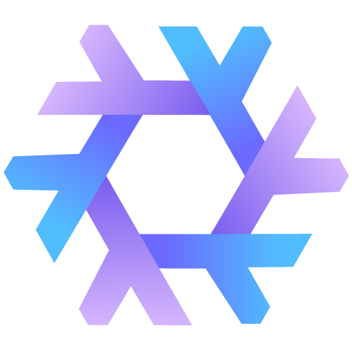

<h1 align="center">Spotandjake ❄️ NixOS Public Configuration</h1>

## 🦊 Introduction

This repository houses my Nix Configurations for my entire system. `config.nix` acts as a highly configurable system definition and the rest of the project is used to build and deeply customize my applications in a highly repeatable manner across different operating systems.

## 📚 Table of contents

- [🦊 Introduction](#-introduction)
- [📚 Table of contents](#-table-of-contents)
- [✨ Features](#-features)
- [📁 File structure](#-file-structure)
- [🤖 Software](#-software)
- [🖥️ Hosts description](#️-hosts-description)
- [⚙️ TODO](#️-todo)
    - [Rewrite](#rewrite)
- [🦋 Inspiration](#-inspiration)
- [License](#license)

## ✨ Features

- ❄️ `Flakes`: I use Nix Flakes for precise dependency management and configuration of my entire system
- 🏡 `Home Manager`: Configures all user facing software.
<!-- - ⚠️ `Impermanence`: Keeps my system fresh by treating only the configured directories and files as persistent -->
- 🍎 `NixDarwin`: Allows me to configure my entire mac declaratively.
- 📁 Config file structure and modules with options.

## 📁 File structure

- [⚡ install.sh](install.sh) A primitive bash installer
- [🖥️ config.nix](config.nix) A Single Configuration File For My Machines
- [❄️ flake.nix](flake.nix) Nix Configuration Entry Point
- [🏡 home](home/default.nix) Home Manager App Configurations
  - [🧩 modules](home/modules/) Home Manager Programs
- [📃 lib](lib/default.nix) Helper functions for creating my configurations.
- [🧩 modules](modules/default.nix) Common modules for `nixos`/`nixDarwin`/`home-manager`
- [♻️ overlays](overlays/) Common Nix Overlays
- [❄️ parts](parts/) Flake parts modules
- [📄 templates](templates/default.nix) Templates for creating configuration parts

## 🤖 Software

- OS - [**`MacOs`**](https://www.apple.com/macos/)
- Editor - [**`Visual Studio Code`**](https://code.visualstudio.com/)
- Terminal - [**`Iterm2`**](https://iterm2.com/index.html)
- Shell - [**`Nushell`**](https://www.nushell.sh/)
- Terminal Filemanager - [**`Yazi`**](https://github.com/sxyazi/yazi)

## 🖥️ Hosts description

| Hostname        | Board               | CPU              | RAM | GPU                 | OS    | State |
| --------------- | ------------------- | ---------------- | --- | ------------------- | ----- | ----- |
| JakesMacBook 💻 | 2020 MacBook Air M1 | Apple Silicon M1 | 8GB | Apple M1 8-Core GPU | MacOS | OK    |

## ⚙️ TODO

This repository is not fully setup and the parts that are, are still a little new below is a list of what I have left todo before considering this configuration complete.

- Packages
  - Microsoft Office
  - A Password Manager
    - It would be nice if it had cli features
    - Raycast support
    - Integrated with Nix setup?
  - Lunar Client
- Settings
  - Darwin
    - The dock
    - Keybindings
    - Anything else I have changed
      - I don't know if there is a good way to see this
  - Visual Studio Code
    - Cleanup User Settings
    - Move User Settings into Nix
    - Audit Keybindings
    - Move Keybindings Into Nix
    - Handle Extensions
  - GitKraken
    - I think these settings exist in `spotandjake/.gitkraken`
    - Try to make a home manager module and upstream
  - Iterm2
    - I think these settings exist in `spotandjake/.iterm2`
    - Try to make a home manager module and upstream
- Research
  - Secrets
    - Do I just use a password manager?
    - Git Signing Keys
    - Gitkraken Authentication
    - Local passkeys
    - nixops
  - Home Manager GPG
    - Look into gpg through git manager idk if git handles it
  - Impersistance
    - This makes any file not in the config act as temporary until the system reboots.
    - I need to handle this last as I don't want to nuke my settings
- My files
  - I need to figure out how I will be backing up my files
    - documents
    - minecraft world
    - desktop?
  - Can I have nix-darwin or a script set up icloud
    - Documents is the main one I need to backup but it would be nice to be able to add others
    - I do not want to backup every folder in Documents
    - I have had permissions and terminal issues in the past with Icloud
- One Password
  - What needs to be brought over to here.
- General
  - Reset my Mac to this
- Cleanup
  - This is my first real Nix setup and I did some things in a non favorite way below is a list of cleanup.
  - Simplify `home/default.nix`
  - Improve `lib/default.nix`
  - Make a custom module system based around `./config.nix`
  - Remove configured settings in `modules/darwin/default.nix`
    - This sets up `nix-darwin` but I want this stuff to be configurable from `./config.nix`

#### Rewrite

- nix tips
  - only access inputs in the flake.nix
- flake parts module system
- home-manager nix darwin
- home-manager nixos
- flake.nix
  - reads system.nix
  - starts nix-parts
    - perSystem???
    - runs a
  - starts either nix-darwin or nixos depending
- lib
  - readme.md
    - I think this is just a standard nix parts module exposing the feature depending on the platform
    - inputs: systems, utils
    - outputs: I don't know yet a standard flake part I think
  - nix-darwin.nix
    - maps all system.nix for any darwin platform
    - get the user for system with utils.getSystemUser
    - maps the dock settings
    - figure out how homebrew works here???
    - maps any brew scripts - how do I do this with home-manager
  - nixos.nix
    - maps all system.nix for any darwin platform
    - maps the dock settings
    - figure out how homebrew works here???
- systems.nix
  - array
    - name: string
    - username: string
    - platform: string
    - specs:
      - cpu
      - memory
      - storage
- utils
  - getSystemUser
    - given a system returns a user configuration
- secrets.toml
  - users array
- users
  - readme.md
    - this contains my user definitions
    - user handle all home-manager configuration
    - they may expose
    - inputs: bundles
    - outputs: username, darwinConfiguration, nixosConfiguration, secretConfig
  - spotandjake.nix - I don't know if i love this layout just yet
    - username: spotandjake
    - darwinConfiguration
      - dock
    - nixosConfigurations
      - I don't know quite yet
    - secretConfig
      - the configuration toml for opnix
- bundles
  - readme.md
    - this contains prebuilt app bundles used by users
    - this contains my
    - inputs: none
    - outputs: sharedPrograms, darwinPrograms, nixosPrograms
  - minDevelopment.nix
    - contains the minimal nix development apps
    - sharedPrograms: nushell, git, vim
    - darwinPrograms:
    - nixosPrograms:
  - devShell.nix
    - sharedPrograms: vscode, gitkraken, yazi
    - darwinPrograms: iterm2
    - nixosPrograms:
  - workStation.nix
    - sharedPrograms: discord,
    - darwinPrograms: raycast, arc
    - nixosPrograms:
- apps
  - readme.md
    - This folder contains app configurations
  - app.nix
    - inputs:
    - just loads all the folder items into the module system
  - program
    - default.nix
      - inputs:
      - program configurations
- configurations
  - readme.md
    - this folder contains
  - ## systems.toml
  - converter
    - maps the toml input file into a nix module
    - with typechecking???? (How do we do this exactly)
  - users
    - spotandjake.nix
  - bundles
    - devShell.nix

* nix-darwin / nixos should manager global machine
* home-manager should handle per user
* opnix is per user and should run along side home-manager

* use this https://github.com/mrjones2014/opnix
* you are going to need to rewrite you app
* basically build all the program configurations using nixs module system
* then pass them in as a static config to the various programs using filters???
* https://github.com/zhaofengli/nix-homebrew/tree/main to install homebrew
* nix-darwin, nixos, nix impersistance at the top level and then home-manager and oxnix as submodules of those that take the builtConfig
* this will all be based on two things
* you will make hosts.nix a json file
  - this will have a list of hosts
  - systemName
  - system-architecture
  - use-home-manager
    - this will need to dissable
  - use-impersistance
    - this needs to enable the module both under home-manager and the top level flake
* you will make users.nix a json file
  - actually maybe make this a yaml or toml file
  - I like yaml
  - Try to make this work with the nix mkSystem?
    - maybe the configuration itself is a nix module???
    - mkOption
    - mkDescription
    - take a look at how home manager does this
    - we will have a loader file which takes our json does a few transforms
      - convert users into a list with username as field
      - provide the json as the nix module fulfilling the config
  - configuration (Basic Data Type)
    - darwin
      - settings
      - programs: { [key: string]: program }
        - program
          - enable: boolean
          - options: jsonObject
      - secrets
        - this will be based off whatever opnix needs
    - nixos
      - settings
      - programs
      - secrets
    - shaded
      - settings
      - programs
      - secrets
  - sharedConfigurations: { [name: string]: configuration }
  - users: { [name: string]: { configuration, list(string) } [key: string]: configuration }
* nix yaml config
* write a superset transpiler that can compile pretty nix into nix, we can use %%% %%% blocks for direct inlays.
  - ...spread
  - reasonML style `let`
  - arrow functions

## 🦋 Inspiration

- [Initial Nix Setup On Mac](https://nixcademy.com/posts/nix-on-macos/)
  - This blog post is a great walkthrough on how to setup `nix-darwin` for Mac.
- [Dotfiles Configuration](https://github.com/nmasur/dotfiles)
  - This is a very popular repository for managing dotfiles with Nix.
  - It was helpful in figuring out the language and a repo structure.
- [Nixos-config](https://github.com/mitchellh/nixos-config)
  - This was a nix config I really liked and found helpful when setting up my configurations.
- [NixOS-Configuration](https://github.com/TheMaxMur/NixOS-Configuration)
  - This was the most helpful repository, my structure is closely based off of this.

## License

These are just my machine configurations, I have licensed them under a completely open license with no restrictions or attribution needed if you want to use any of this. Be mindful that the software installed by this configuration is subject to it's own licensing terms.
